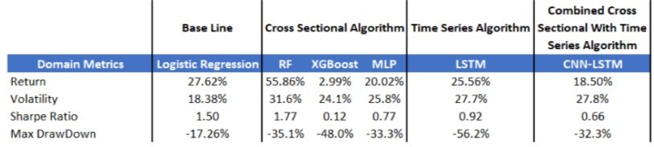

# Stock-Returns Prediction

This was a project we did as part of our Probabilistic Time Series Analysis Class. In this Project, we built several models to classify future(5-day) stock returns for over 3000 stocks as being above or below the median rate of return for the day. We trained our models on one year of data and used it to predict the next one year. We trained several models, including Logistic Regression, XG Boost, Gaussian Processes, Multi Layer Perceptron(MLP) Random Forest, LSTM and a CNN-LSTM. We had data for over 3000 stocks, spanning 7 years, with around 400 features. To test for profitability, we used a trading strategy directed by the trained models, wherein, we long the stocks with top 50 highest scores(probabilities) for having a rate a return above the median rate of return, 5 days in the future, while we short the stocks with scores in the bottom 50. Random Forest performed the best, on Profitability Metrics as well as Machine Learning Performance Metrics.

## Features:

## Architecture for the CNN-LSTM:

## Results:

### Machine Learning Metrics:

### Financial Metrics

We also trained the Multi Layer Perceptron(MLP) for 3-class classification, changing the targets such that each could be classified to have a rate of return in the top 10%, the bottom 10% or the middle for the day. One can see that some Financial metrics, like Sharpe Ratio, Max Drawdown and Returns improve significantly.

## Report:

[Report](https://github.com/amartyap/Predicting-Stock-Returns-PTSA-Project/blob/master/Project%20Report_PTSA.pdf)

## Team:
1. Amartya Prasad 
2. Steffen Roehershieim          
3. Tianmu Zhao 

## Referencing:

Please reference this work, if you decide to use it.
